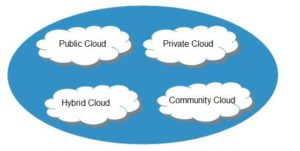

Cloud computing has been a hot topic for several years now. Many organizations have already made the switch from on-premise infrastructure to either a hybrid cloud approach or full cloud adoption.  However, most individuals coming into the cloud space have limited to no knowledge and with all of the information out there, it can be hard to know where to start.  The questions we intend on answering in this post are:

- What is cloud computing?
- What are the characteristics of cloud computing?
- What are the different service models?
- What are the different deployment models?

## What is Cloud Computing?

The National Institute of Standards and Technology defines cloud computing as a model for enabling ubiquitous, convenient, and on-demand access to a shared pool of configurable resources.  These technologies allow for the delivery of computing services, including servers, storage mediums, databases, and networking, over the internet.  Furthermore, all cloud service providers have their own definition of cloud computing, but they are all primarily the same underneath.

Compared to a traditional on-premise IT system, cloud computing has allowed information technology departments the ability to be more elastic while simultaneously reducing overhead expenditures on procuring infrastructure investments.  This has brought about a "fail fast" mentality to increase the time to market allowing the organizations that adopt the technology to get a leg up on the competition.

## What are the Characteristics of Cloud Computing?

Cloud computing has many characteristics and to attempt to simplify it, I will only highlight 5 of the top characteristics. They are:

1. Resource Pooling
2. On-Demand Self-Service
3. Resiliency
4. Scalability and Elasticity
5. Measured Service

### Resource Pooling

The main characteristic of cloud computing is resource pooling.  Resource pooling entails that a cloud service provider shares its resources among several different clients.  This does not mean that what I have running in my resource is accessible by your resource because each client is provided a different set of services based on their needs.

### On-Demand Self-Service

Cloud computing's characteristic of on-demand self-service enables clients to spin up or create resources as needed.  This alleviates the hassle of having to buy infrastructure equipment.  Furthermore, the clients are able to do all of these actions through a self-service, easy-to-navigate web console.

### Resiliency

Resiliency in cloud computing means that a service is able to quickly recover from a disruption.  Cloud service providers ensure that the client systems are running on hardware that is constantly monitored for any issues.  If an issue is detected, the client is either notified or the service is migrated to healthier hardware.

### Scalability and Elasticity

Cloud computing has allowed information technology teams to become more elastic.  Elasticity works in tandem with scalability.  For instance: if there is an influx in traffic, IT teams do not have to worry about the infrastructure required for more computing load or processing power, they just need to provide more resources to handle the traffic.

### Measured Service

Not only does the cloud service provider measure the service usage for their resources, but cloud computing allows the client to measure this information also.  This can be done for many reasons like spending monitoring and ensuring effective use of resources.

## What are the Different Service Models?

There are different cloud computing models available depending on your need.  The three most common models are IaaS (Infrastructure-as-a-Service), PaaS (Platform-as-a-Service), and SaaS (Software-as-a-Service).  Many organizations choose to use all three models and this is not uncommon.  However, there may be some confusion on which is which and what's included.

### IaaS (Infrastructure-as-a-Service)

IaaS provides on-demand access to resources fundamental to computing infrastructures, such as compute, network, or storage.  The physical facilities and infrastructure hardware form the foundation of this service model.  However, with cloud computing, we are able to abstract and pool these resources.  The abstraction frees the resources from their physical limitation usually through virtualization, and orchestration tools tie the abstracted resources together, creating the resource pools for clients.

### PaaS (Platform-as-a-Service)

PaaS adds an additional layer of integration with application development frameworks, middleware (provides services to software applications) capabilities, and other functions such as databases, queuing, and messaging.  These services allow developers the ability to build their applications on the platform with languages and tools that are supported.

### SaaS (Software-as-a-Service)

SaaS services are full applications with all the complexities of any larger software platform.  Many of the providers for SaaS build on top of both IaaS and PaaS due to the increased agility, resilience, and economic benefits.  There is an application/logic layer and data storage with an API on top.  Then there are one or more presentation layers, oftentimes including web browsers, mobile applications, and public API access.

## What are the Different Deployment Models?

There are 4 different deployment models available to cloud consumers.  Depending on the size of the organization, many enterprise-level cloud environments will be either public or hybrid in their deployment type.  The four models are **public cloud, hybrid cloud, private cloud,** and **community cloud.**

### Public Cloud Computing Model

The public cloud allows its systems to be accessible by the general public.  This deployment model is the most widely used model and has become the most popular option for file sharing, web applications, and data storage.

The cloud service provider (CSP) owns and operates all of the underlying hardware needed.  CSPs keep this hardware in massive data centers, usually all around the globe.

### Private Cloud Computing Model

Private cloud infrastructure is operated solely for a single organization.  The cloud computing infrastructure is managed by the organization or may even be managed by a third party and it may either be on-premise or off-site.  This model is generally seen in larger organizations that have a need and where the cost of using the public cloud is usually more expensive.

### Community Cloud Computing Model

The cloud infrastructure is shared by several organizations and supports a specific community with shared concerns.  As with the private cloud infrastructure, this can also be managed by the organization or a third party, and may also be on-premise or off-premise.

### Hybrid Cloud Computing Model

The hybrid cloud deployment model is any combination of two or more clouds.  These clouds remain unique entities but are bound together by proprietary or standardized technology enabling data and application portability.  Furthermore, a hybrid cloud has also been used to describe a non-cloud data center bridged directly to a cloud provider.